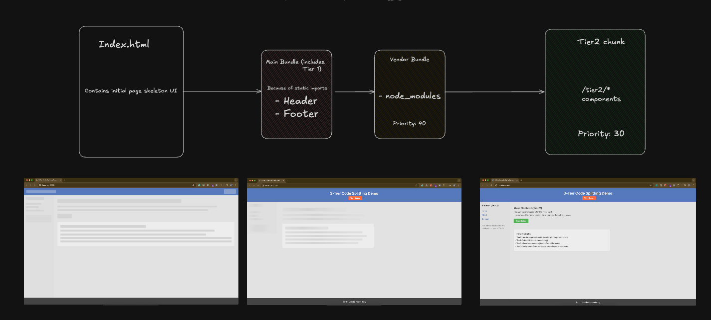

# Three-Tier UI Rendering with Code Splitting

This is an implementation of a three-tier UI rendering approach using code splitting, inspired by Facebook's loading strategy.

## Core Concept

Split UI rendering into three priority levels:

1. **Tier 1: Critical UI** - Loads immediately

   - Basic layout and structure (Header, Footer)
   - Uses regular imports
   - Provides immediate visual feedback to users
   - Includes critical interactive elements (e.g., primary navigation buttons)

2. **Tier 2: Secondary UI Components** - Loads after initial paint

   - Main content and UI components (MainContent, Sidebar)
   - Uses `loadVisual()` function with React.lazy and Suspense
   - Completes the visual experience after the initial frame is rendered
   - Includes secondary interactive elements

3. **Tier 3: Background Features** - Will be implemented in future updates
   - Non-essential background processes
   - Analytics, logging, and data synchronization
   - Features that don't affect the visual display
   - Low-priority interactive elements


## Webpack build
Your Application Bundles:


## File Structure

```
src/
  ├── tier1/            # Critical UI components (load immediately)
  │   ├── Header.js
  │   └── Footer.js
  ├── tier2/            # Secondary UI components (load after initial paint)
  │   ├── MainContent.js
  │   └── Sidebar.js
  ├── App.js            # Main app that orchestrates component loading
  ├── index.js          # Entry point
  ├── loaders.js        # Loading system with custom component loaders
  └── styles.css        # Styles
public/
  └── index.html        # Initial HTML with skeleton UI before JS loads
```

## Key Features

1. **Tiered Directory Structure**: Components are organized by loading priority
2. **Initial HTML Skeleton**: Provides immediate visual structure before any JavaScript loads
3. **Custom Loading System**: The `loadVisual()` function handles loading Tier 2 components
4. **Component-Specific Skeletons**: Each component has its own tailored loading state
5. **Interactive Elements by Tier**: Demonstrates how button handlers are prioritized
6. **Webpack Configuration**: Automatically splits code based on the tier structure

## How It Works

1. **Before JavaScript**: The initial HTML displays a skeleton UI
2. **Tier 1 Loading**: Critical UI components (Header, Footer) load immediately
3. **Tier 1 Interaction**: Critical button handlers become available immediately
4. **Tier 2 Loading**: Secondary components (MainContent, Sidebar) load after initial paint
5. **Tier 2 Interaction**: Secondary button handlers become available after their components load
6. **Tier 3 Loading**: (Future implementation) Background features will load after display is complete

## Performance Benefits

- Users see a meaningful UI immediately
- Critical interactions are available without delay
- Secondary content loads progressively without blocking the initial render
- Background features don't interfere with the user experience
- Reduced perceived loading time through skeleton screens
- Minimal layout shifts during loading

## Running the Demo

```
npm install
npm start
```

Open your browser's console to see the loading sequence of each tier. Click the Tier 1 and Tier 2 buttons to observe the difference in when their handlers become available. (For better visuals make the network in slow - 3G)
